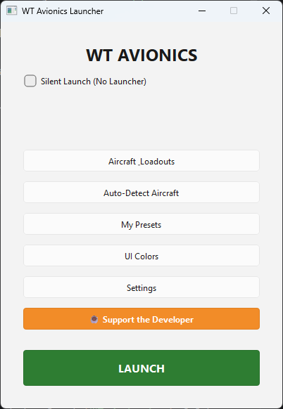
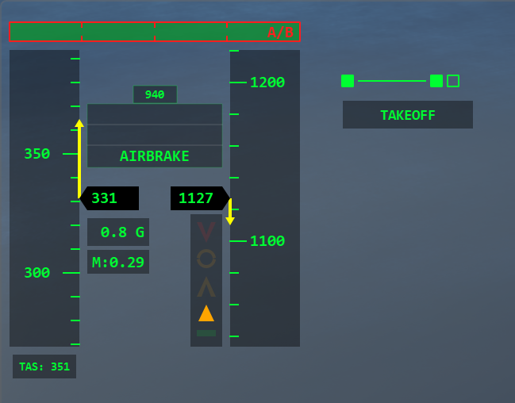
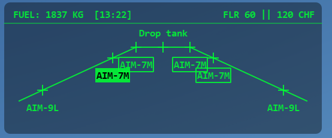

# ✈️ WT Avionics

**WT Avionics** is a highly optimized, standalone Head-Up Display (HUD) and telemetry overlay for War Thunder. Designed to enhance the flight simulator experience, it provides real-time aircraft telemetry, dynamic weapon loadout tracking, and a customizable user interface without altering any game files.

> **Disclaimer:** This application is **100% Safe and TOS-Compliant**. It does NOT inject into the game's memory, modify game files, or provide unfair advantages. It operates entirely by reading the official War Thunder local browser map API (`http://127.0.0.1:8111`) and using screen-reading OCR for weapon seekers.

## 🚀 Features

* **Real-Time Telemetry:** Tracks speed, altitude, pitch, roll, and engine state via the official local API.

* **Dynamic Payload Tracking:** Uses a custom aircraft database to display active pylons, remaining weapons, and current seeker states.

* **Optical Character Recognition (OCR):** Seamlessly reads the in-game UI via `pytesseract` and `OpenCV` to detect specific radar/IR seeker statuses.

* **Adaptive Overlay:** A fully transparent, click-through HUD that runs smoothly over the game window.

* **Built-in Launcher & Preset Manager:** Easily manage your aircraft loadouts, customize HUD colors, and auto-detect your current vehicle from the hangar.

* **Zero-Setup Deployment:** Packaged as a standalone `.exe` for instant use.

## 📸 Preview



*(Launcher main window)*


*(Select Nation window)*



*(HUD Preview)*



*(Stores Management System Preview)*
## 🛠️ Installation & Usage (For Players)

You do not need Python installed to run WT Avionics.

1. **Download the latest release:** Go to the `dist` folder and download `WT_Avionics` folder.

2. **Install Tesseract OCR:**

   * Run the included `tesseract-ocr-setup.exe`.

   * **Important:** Install it in the default directory (`C:\Program Files\Tesseract-OCR`). The HUD relies on this to read weapon text.

3. **Run the App:** Extract the ZIP archive and run `WT_Avionics.exe`.

4. **Launch:** Select your aircraft loadout, customize your colors, and press **LAUNCH**.

## 💻 Development (Building from Source)

If you want to contribute, modify the code, or build the executable yourself, follow these steps:

### Prerequisites

* Python 3.10+

* Tesseract OCR installed in `C:\Program Files\Tesseract-OCR`

### Setup Environment

```
# Clone the repository
git clone https://github.com/YourUsername/WT_Avionics.git
cd WT_Avionics

# Install required dependencies
pip install -r requirements.txt

```

### Running the App

```
python main.py

```

### Building the Executable

The project includes an automated build script utilizing `PyInstaller`. It automatically packages the app, bundles the required `data` and `assets` folders, and safely purges local developer configs (like your personal favorites or keybinds) from the final release.

```
python build.py

```

The compiled, ready-to-distribute standalone application will be generated in the `dist/WT_Avionics` folder.

## 🏗️ Architecture overview

* **`launcher/`**: A PySide6-based GUI that manages configurations, reads JSON databases, and spawns the background HUD process.

* **`gui/overlay.py`**: The transparent click-through Qt window that renders the actual HUD.

* **`core/telemetry.py`**: A dedicated `QThread` that safely polls the WT local API without blocking the main UI thread.

* **`core/screen_reader.py`**: Utilizes `mss` for high-speed screen capture and `OpenCV` + `Tesseract` to process specific screen regions.

* **Entry Point Switch:** The app uses an advanced `--overlay` argument execution flow, allowing a single compiled `.exe` to act as both the GUI Launcher and the background HUD process.

## ☕ Support the Developer

If you find this HUD useful and want to support further development, you can [buy me a coffee!](https://ko-fi.com/alice_kojima)


## 📄 License

This project is licensed under the GNU GENERAL PUBLIC LICENSE Version 3
